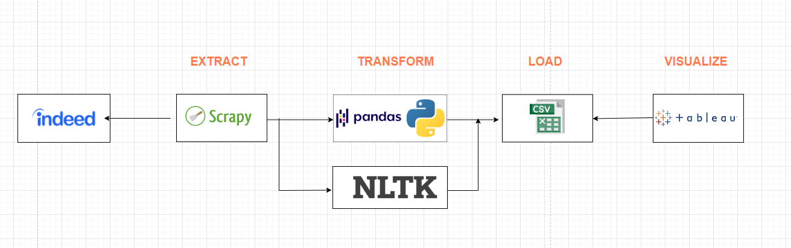
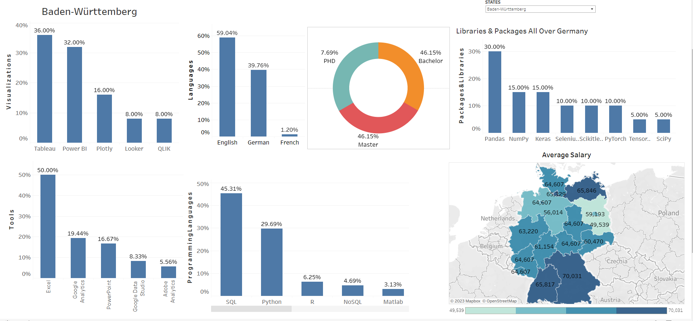

# An ETL data pipeline for Analyzing a Data Analyst Role for all 16 States in Germany

## Goal Of The Project:
Extract the vacancies posted for a data analyst role from Indeed using a spider build in Scrapy for all the 16 states and visualize the data in Tableau as a dashboard to show which programming languages, tools, education level, salary, preferred communication language, libraries and packages are needed to be a well-equipped data analyst.

## Table of Contents:
<ol>
    <li><a href="#about_the_data"> <b>About The Data </a></b></li>
        <li><a href="#extract"><b> Extract </a></b></li>
        <li><a href="#transform"><b> Transform </a> </b>
        </li>
        <li><a href="#load"><b> Load </a> </b></li>
        <li><a href="#visualize"><b> Dashboard </a> </b></li>
    </li>
</ol>

<h3 id ="about_the_data">1. About The Data:</h3>
The data used in this project has been extracted from:
<a href="https://de.indeed.com/">Indeed</a>  
 
<h3 id="extract">2. Extract</h3>
A spider has been build in Scrapy, which extracts the data of requirement section for all the states that has posted for Data Analyst jobs and once the extraction for one state has been completed, the raw data is stored as a CSV file per state.  
 

<h3 id="transform">3. Transform</h3>
Once all the extraction process is completed and we have data in CSV files, 16 CSV files for 16 different states, NLTK and Pandas are used to do all the data cleaning, removing stop words, filtering, merging and concatenation of all the separate CSV files into a single file.  
 

<h3 id="load">4. Load</h3>
Once all the transformation is done, all the 16 CSV files are carefully analyzed before concatenating them into a single CSV file regarding the column names and finally loaded/saved as a CSV file for building a dashboard in Tableau. 
 

<h3 id="visualize">5. Dashboard</h3>
Finally, the CSV file is imported in Tableau and the dashboard has been created.
Feel free to play around, you can access the dashboard from here: <a href="https://public.tableau.com/app/profile/nishan.karki/viz/Book1_16575695920440/Dataanalystrequirementanalysis"> Skills Needed To Be A Data Analyst</a>
 
 
<h4>Below is a screen shot of the dashboard, on the top right corner, you can find a drop-down menu and filter through different states as per your curiosity. </h4>
